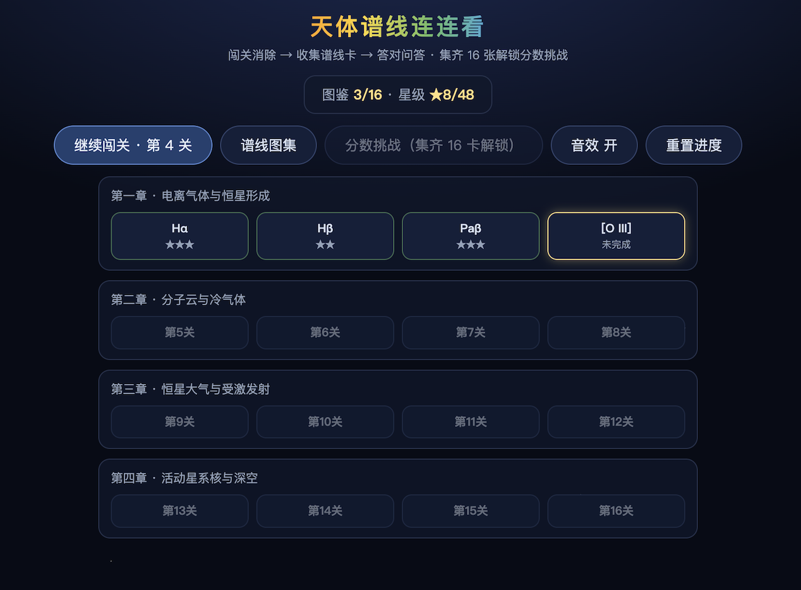
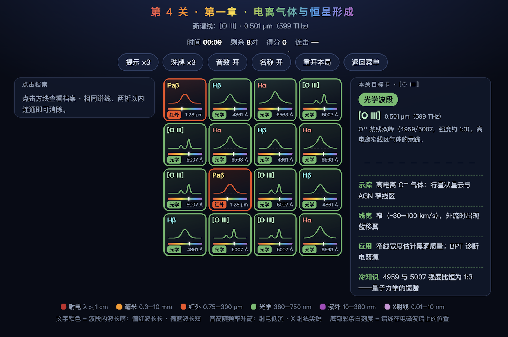

# 天体谱线连连看 🔭

一个将**天体物理谱线知识**与经典**连连看玩法**结合的教育小游戏。纯单文件 HTML 实现，零依赖，打开即玩。





## 玩法

- 点击两个**相同谱线**的方块，若它们能在**两折以内**连通（可从棋盘外围绕），即可消除。
- 点击任意方块可查看该谱线的**档案卡**：示踪对象、典型线宽、科学应用与冷知识。
- 限时 5 分钟，连击可获得额外加分（`10 + (连击-1) × 5` 分），道具：提示 ×3、洗牌 ×3。

## 游戏模式

### 📖 关卡闯关
共 **20 关**，分为五章，棋盘随进度从 4×4 逐步扩大到 8×8，每关引入一条新谱线：

| 章节 | 关卡 | 棋盘 |
|---|---|---|
| 第一章 · 电离气体与恒星形成 | 1–4 | 4×4 |
| 第二章 · 分子云与冷气体 | 5–8 | 6×6 |
| 第三章 · 恒星大气与受激发射 | 9–12 | 6×6 |
| 第四章 · 活动星系核与深空 | 13–16 | 8×8 |
| 第五章 · 河外星系谱线 | 17–20 | 8×8 |

### ⭐ 图鉴收集与问答
- 首次通关新谱线后，会解锁该谱线的**收藏卡**，并进入 **3 题小测验**——答对几题即获得几颗星（0–3 星）。
- 在图鉴中可随时查看卡片详情，或**重测升星**。
- 收集进度与星级自动保存在浏览器（localStorage）中。

### 🏆 分数挑战
**集齐 20 张谱线卡后解锁**：全部 20 种谱线随机出现在 8×10 棋盘上，且**隐藏名称、只看曲线认谱线**，冲击最高分。

## 收录的 20 条谱线

| 波段 | 谱线 |
|---|---|
| 射电 | HI 21cm、OH maser |
| 毫米 | CO(1-0)、HCN(1-0) |
| 红外 | Paβ、H₂ S(1)、Ca II 三重线、[C II] 158 μm |
| 光学 | Hα、Hβ、[O III]、Na D、Ca H&K、[O II]、[N II]、[S II] |
| 紫外 | Lyα、C IV、Mg II |
| X 射线 | Fe Kα |

游戏中的小细节：
- 方块文字颜色表示**波段内波长序**（偏红波长长，偏蓝波长短）；
- 消除时的**音高随谱线频率升高**（射电低沉、X 射线尖锐）；
- 每个方块上的曲线是该谱线的**典型线型轮廓**，底部彩条上的白色刻度标示其在电磁波谱上的位置。

## 运行

无需安装任何依赖：

```bash
# 直接用浏览器打开
open index.html
```

或在 Node.js 中运行内置自测：

```bash
node index.html
```

也可以直接访问 GitHub Pages 在线游玩（在仓库 Settings → Pages 中开启后，访问 `https://<用户名>.github.io/spec-onet-connect-demo/`）。

## 技术说明

- 单文件 `index.html`，原生 HTML/CSS/JavaScript，无任何外部依赖或构建步骤；
- 谱线数据（描述、典型轮廓 SVG 路径、测验题库）内置于 `LINES` 数组；
- 进度存档使用 `localStorage`（键名 `tlx_lianliankan_v1`）；
- 文件底部附带连通性判定与关卡牌堆的自测脚本，可在 Node 中直接运行验证。
